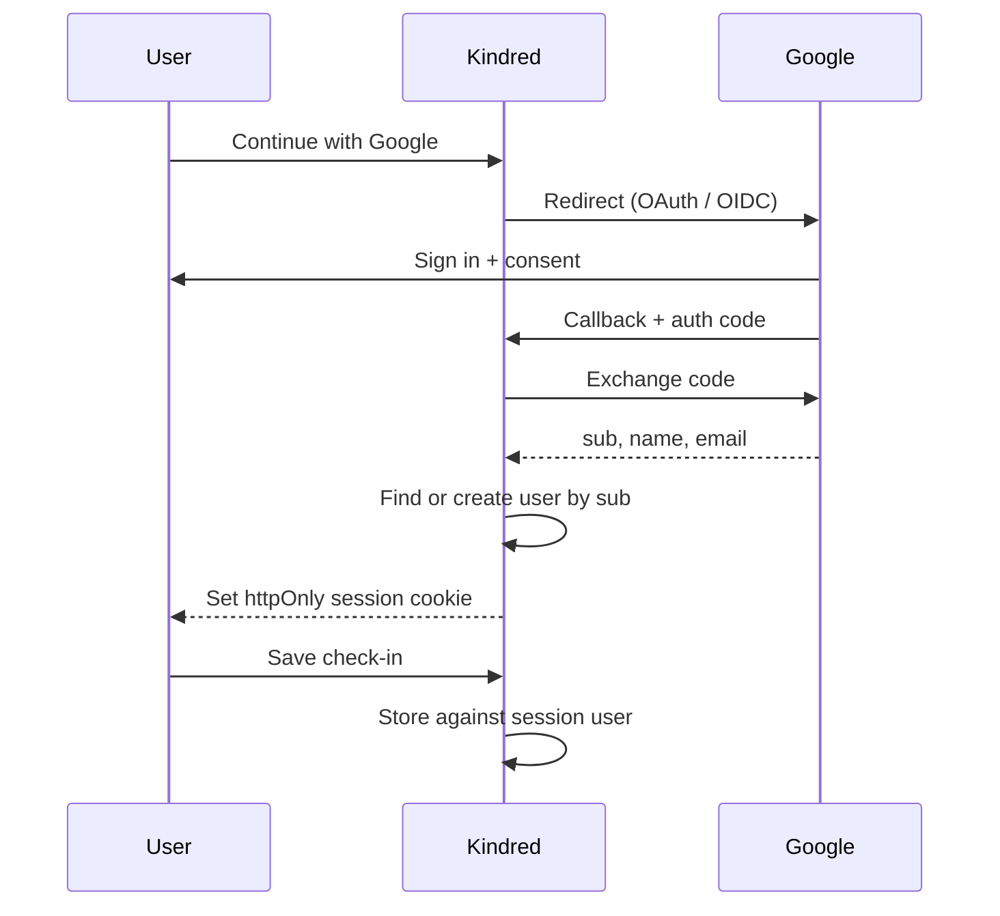

# Plan: Google login so Kindred recognizes a real user

Status: **proposal only** — not implemented. The running demo still uses the in-memory profile switcher (`maya`, `jordan`, `sam`, `shashank`).

This document records how to replace that switcher with an established identity provider (Google as the first example) so the app can recognize the same person on later visits.

Related: [mental-health-app-hld.md](./mental-health-app-hld.md) §4 already names Auth as a first-class module and lists Clerk/Auth0 or sessions as the auth options.

---

## 1. Current state

| Piece | Today |
|---|---|
| Identity | Demo profiles in `server.js` (`users` array) |
| Session | None. The client sends `?userId=` on every dashboard fetch |
| Check-ins | In-memory array, keyed by `userId` string |
| Persistence | Lost on every Render restart / redeploy |
| Login UI | Profile chips + “Try a demo week” |

Google (or any OIDC provider) does **not** log someone into Kindred by itself. It only **proves who they are**. Kindred must then:

1. Receive a stable ID from the provider (`sub`)
2. Look up or create a row in **our** users table
3. Set a **session cookie**
4. Key check-ins to that user, not to `maya`

**Use `sub`, not email, as the primary key.** Emails change; `sub` does not.

---

## 2. Target flow



After login, **stop taking `userId` from the query string.** Dashboard and check-in writes must use the session.

---

## 3. Google Cloud setup

In [Google Cloud Console → Credentials](https://console.cloud.google.com/apis/credentials):

1. Create a project (or reuse one).
2. Configure the **OAuth consent screen** (External is fine for a demo).
3. **Create credentials → OAuth client ID → Web application**.
4. Authorized redirect URIs:
   - `http://localhost:10000/auth/google/callback`
   - `https://YOUR-RENDER-URL/auth/google/callback`
5. Copy **Client ID** and **Client secret**. Never commit them.

Render (and local) environment variables:

| Variable | Purpose |
|---|---|
| `GOOGLE_CLIENT_ID` | Public OAuth client id |
| `GOOGLE_CLIENT_SECRET` | Server-only secret |
| `SESSION_SECRET` | Long random string used to sign the session cookie |
| `APP_BASE_URL` | `http://localhost:10000` locally, `https://…onrender.com` in prod |

Scopes: `openid email profile` only. Do not request extra Google APIs.

---

## 4. Routes to add on `server.js`

Auth sits beside the existing `/api/users`, `/api/dashboard`, `/api/check-ins` handlers.

| Route | What it does |
|---|---|
| `GET /auth/google` | Redirect the browser to Google |
| `GET /auth/google/callback` | Exchange the code, upsert user, set cookie, redirect `/` |
| `POST /auth/logout` | Clear the session cookie |
| `GET /api/me` | Return the signed-in user, or `401` |

Libraries that fit this repo (plain Node, no framework):

- [`openid-client`](https://www.npmjs.com/package/openid-client) — Google is an OpenID provider
- [`google-auth-library`](https://www.npmjs.com/package/google-auth-library) — Google-specific
- Cookie session: `httpOnly`, `Secure` in production, `SameSite=Lax`

Do **not** put Google tokens in `localStorage`. The browser only needs Kindred’s session cookie.

Sketch of the identity step on callback:

```js
const user = usersBySub.get(session.sub) ?? createUserFromGoogle(profile);
// later:
checkIns.filter((c) => c.userId === user.id);
```

---

## 5. Data model

Render restarts wipe in-memory arrays. Recognition across days needs a database (Render Postgres is the straightforward fit).

```
users
  id            uuid
  google_sub    text unique   -- how we recognize them next time
  email         text
  name          text
  picture_url   text
  created_at    timestamptz

check_ins
  id, user_id, mood_score, note, tags[], date
```

- First Google login → `INSERT` into `users`.
- Next login → `SELECT WHERE google_sub = $sub` → same person, same history.
- Keep mood notes in this tightly scoped table; do not mix them with any future social/feed tables (see HLD §3).

Demo profiles can remain as **seeded, labeled demo data**, not as the signed-in identity.

---

## 6. UI change (`public/index.html` + `public/app.js`)

Replace the profile chips as the primary identity control with:

- **Continue with Google** → `GET /auth/google`
- Header shows name / photo from `GET /api/me`
- **Log out** → `POST /auth/logout`
- Maya / Jordan / Sam / Shashank remain only as a clearly labeled **demo data** mode (optional, off by default once login works)

Keep crisis copy public. Do not hide 988 behind a login wall.

Signed-out home: check-in CTA still visible, but saving requires login (redirect to Google, then resume).

---

## 7. Faster alternative

If we do not want to implement the OAuth handshake in `server.js`:

| Option | What we store |
|---|---|
| [Clerk](https://clerk.com) | Their `user.id` on our `check_ins.user_id` |
| [Auth0](https://auth0.com) | Same — provider user id as our foreign key |
| [Firebase Auth](https://firebase.google.com/docs/auth) | Same |

The product rule is identical: **Kindred’s user row is keyed to the provider’s stable id.** Clerk/Auth0 is more product, less protocol, and matches the HLD’s “don’t roll your own crypto” guidance.

Recommendation for this repo: **Clerk or Auth0** if we want the Google button quickly; **openid-client + Render Postgres** if we want zero extra vendor beyond Google.

---

## 8. Safety and privacy (non-negotiable for this category)

This remains not a clinical product. If real people sign in:

- Ask Google only for `openid email profile`
- Store as little as needed (`google_sub` + display name is enough to recognize someone)
- Keep “not medical care / do not enter real health information” on the signed-in dashboard until this is no longer a demo
- Encrypt at rest and add a real privacy policy before inviting anyone beyond the authors
- Session cookies: `httpOnly`, `Secure`, `SameSite=Lax`; short idle timeout is fine for a check-in app

---

## 9. Implementation order (when we build this)

1. Provision Render Postgres (or local Postgres) and a `users` / `check_ins` schema.
2. Add env vars and Google OAuth client (localhost + Render redirect URIs).
3. Implement `/auth/google`, callback, `/api/me`, logout; session cookie.
4. Change `/api/dashboard` and `POST /api/check-ins` to use the session user.
5. Swap profile chips for Continue with Google; keep demo profiles behind a labeled toggle.
6. Verify: new Google account → check-in → restart the service → same history.
7. Do not treat this as production-ready until persistence, HTTPS cookies, and the safety copy are in place.

Out of scope for the first auth slice: Apple/GitHub login, 2FA, account deletion UI, exporting data, migrating demo check-ins onto a real Google user.
